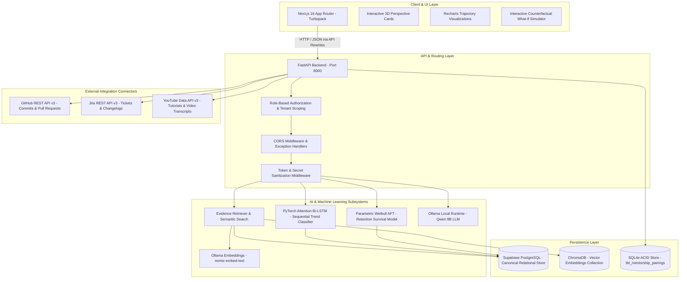
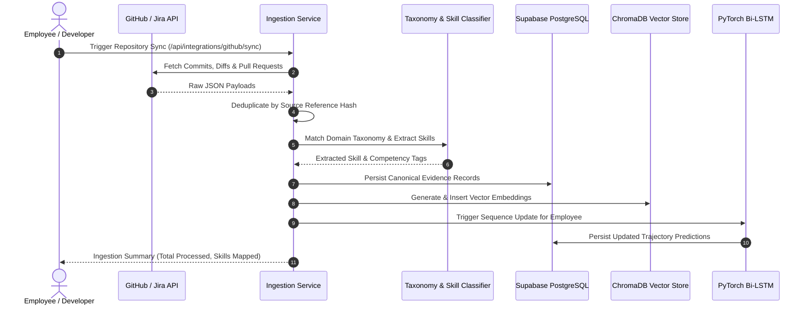

# GrowthLens Architecture Specification

This document provides the authoritative architectural reference for **GrowthLens**, a Continuous Talent Intelligence and Skill Growth Platform developed for **HackMatrix 5.0 (Track MISC02)**.

---

## 1. System Topology Overview

GrowthLens employs a multi-tiered, privacy-first architecture separating user experience, asynchronous telemetry ingestion, deep sequential classification, vector retrieval, and local generative reasoning.

---

## 2. Layer-by-Layer Responsibilities

### 2.1 Presentation Layer (Frontend)
- **Framework:** Next.js 16.3.6 (React 19, TypeScript, Turbopack).
- **Styling Architecture:** Tailwind CSS v4 paired with the custom **Moonwood Design System** (`#DFE968` Electric Lime, `#FBF1CF` Warm Cream, `#1C1C1C` Carbon Black, 1.5px solid borders, and Yellowtail cursive typography accents).
- **Component Primitives:**
  - `DeveloperCard.tsx`: 3D perspective glass cards with transform-style preservation and dynamic badge clusters.
  - `TrajectoryChart.tsx`: Multi-series Recharts component rendering historical competency trajectories, parametric decay curves, and counterfactual simulation deltas.
  - `LoadingSkeleton.tsx` & `EmptyState.tsx`: High-grade feedback states preventing layout shift during asynchronous data fetches.
- **Proxy Layer:** Configured in `frontend/next.config.ts` to seamlessly rewrite `/api/:path*` to `http://127.0.0.1:8000/api/:path*`.

### 2.2 Application Services Layer (Backend)
- **Framework:** FastAPI with Python 3.11+.
- **Concurrency Model:** Hybrid async/threadpool architecture. Pure I/O endpoints run on the asynchronous event loop, while intensive relational and ML inference tasks execute within Starlette worker threadpools (`asyncio.to_thread`) to guarantee non-blocking responsiveness under high concurrency.
- **Error Handling:** Centralized `GrowthLensError` hierarchy mapping domain exceptions to RFC 7807 compliant HTTP status codes.

### 2.3 Machine Learning & Predictive Layer
- **Sequential Trend Classification:** A custom PyTorch Attention Bi-LSTM (`backend/feature2/lstm_model.py`) evaluates longitudinal competency sequences across 9 temporal features, outputting calibrated probability distributions over `[declining, stagnating, improving]`.
- **Parametric Survival Analysis:** Accelerated Failure Time (Weibull AFT) modeling in `ml/retention_inference.py` predicts retention probabilities at 30, 60, 90, and 180 days with hazard factor decomposition.
- **Explainable What-If Engine:** Counterfactual inference computes expected trajectory deltas and lifespan gains following synthetic assessments, course completions, or project outcomes.

### 2.4 Generative Reasoning & RAG Layer
- **Local Model Execution:** Ollama running `qwen3:8b` produces grounded, evidence-backed narrative justifications without transmitting employee code outside corporate boundaries.
- **Vector Retrieval:** ChromaDB indexes 768-dimensional embeddings generated via `nomic-embed-text`, enforcing strict tenant- and employee-level isolation filters.

### 2.5 Data Persistence Layer
- **Relational Primary Store:** Supabase PostgreSQL manages relational entities: `employees`, `competencies`, `evidence`, `competency_trajectories`, `recommendations`, `profiles`, `teams`, and `organizations`.
- **Local ACID Store:** SQLite (`backend/data/mentorship_pairings.db`) provides guaranteed transactional persistence for peer mentorship workflows with compound indexing.
- **Vector Store:** ChromaDB stores chunked, deduplicated work records with semantic tags.

---

## 3. Asynchronous Ingestion & Evidence Flow

---

## 4. Architectural Invariants & Security Guardrails

1. **No Cold-Start Assumptions:** If an employee has fewer than 3 verified evidence records in a competency, the trajectory engine strictly emits `insufficient_evidence` with 0.0 confidence, routing the learner to foundational ramp-up actions rather than declaring a negative performance decline.
2. **Employee Isolation:** Vector and relational queries require an explicit employee UUID or authorized organization ID constraint. Cross-employee data retrieval by non-manager accounts results in an HTTP 403 Forbidden.
3. **Reproducible Model Packaging:** Model weights (`feature2_lstm_v1.pt`) are accompanied by explicit hyperparameter metadata, seed records, and evaluation JSON reports to ensure strict reproducibility.
