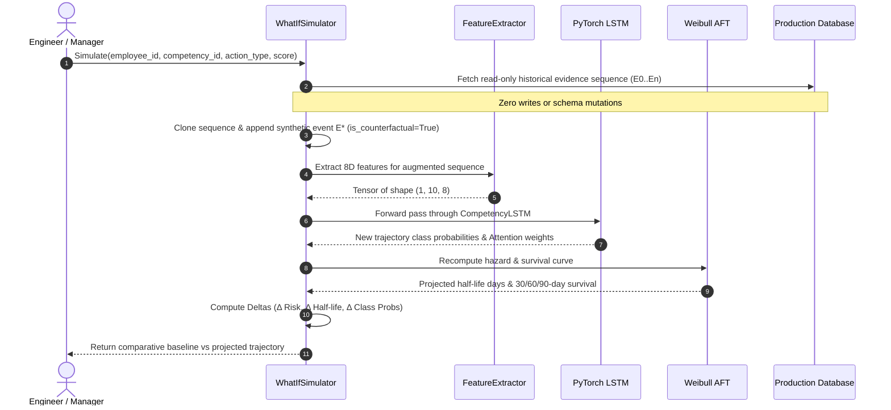

# GrowthLens Machine Learning Specification

## 1. Executive Summary & Dual-Paradigm Architecture

GrowthLens adopts a multi-tiered, empirically validated machine learning architecture designed specifically for continuous talent intelligence. Traditional human resource systems rely on static annual reviews or heuristic point scores that compress multi-dimensional software engineering contributions into arbitrary scalar metrics.

In contrast, GrowthLens implements a **three-pillar AI/ML system**:
1. **Longitudinal Sequential Deep Learning (`CompetencyLSTM`)**: A PyTorch-based bidirectional recurrent neural network augmented with a temporal attention mechanism to model temporal dependencies, velocity, acceleration, and inflection points across chronological evidence vectors.
2. **Parametric Survival Analysis (`WeibullAFTFitter`)**: Accelerated Failure Time (AFT) hazard modeling using the Weibull distribution to project skill decay probabilities across 30, 60, 90, and 180-day horizons, determining empirical competency half-lives.
3. **Local RAG & Generative Synthesis (`Ollama` + `Qwen 2.5 8B`)**: On-premise, zero-data-leakage LLM pipeline that performs contextual reasoning, generates explainable executive briefings, anchors recommendations to verified evidence IDs, and provides mentorship pairing rationales.

```mermaid
flowchart TD
    subgraph Data Layer [Multi-Modal Telemetry & Ingestion]
        GH[GitHub Commits & PRs]
        JI[Jira Issues & Sprints]
        AS[Assessments & Quizzes]
        PO[Project Milestones]
        EV_DB[(Supabase Evidence Store)]
    end

    subgraph Feature Engineering [Longitudinal Feature Extraction]
        FE_SEQ[8D Temporal Feature Extractor]
        FE_SURV[9D Longitudinal Aggregator]
        VEC[ChromaDB + Nomic-Embed-Text]
    end

    subgraph Core ML Inference Layer [Predictive Models]
        LSTM[PyTorch CompetencyLSTM + Attention<br/>Accuracy: 80.47% | Declining F1: 0.9800]
        WEIBULL[Weibull AFT Survival Fitter<br/>C-Index: 0.7939 | Brier: 0.1366]
    end

    subgraph Post-Processing & Calibration [Calibration & Simulation]
        CONF[Exponential Freshness & Confidence Calibration]
        WHATIF[Isolated What-If Counterfactual Engine]
    end

    subgraph Generative & Recommendation Layer [Contextual Synthesis]
        QWEN[Ollama / Qwen 2.5 8B Inference Engine]
        REC[Multi-Armed Recommendation Selector]
        YT[YouTube Data API v3 Deep-Linking]
    end

    GH --> EV_DB
    JI --> EV_DB
    AS --> EV_DB
    PO --> EV_DB

    EV_DB --> FE_SEQ
    EV_DB --> FE_SURV
    EV_DB --> VEC

    FE_SEQ --> LSTM
    FE_SURV --> WEIBULL

    LSTM --> CONF
    WEIBULL --> CONF
    CONF --> WHATIF

    CONF --> REC
    VEC --> QWEN
    REC --> YT
    REC --> QWEN
```

---

## 2. Pillar I: PyTorch CompetencyLSTM (Longitudinal Classification)

### 2.1 Model Topology
The trajectory classification network is implemented in PyTorch (`models/feature2/feature2_lstm_v1.pt`) and accepts fixed-length padded sequences of chronological evidence vectors.

```
CompetencyLSTM(
  (lstm): LSTM(
    input_size=8, 
    hidden_size=32, 
    num_layers=1, 
    batch_first=True
  )
  (attention): TemporalAttention(
    (attn): Sequential(
      (0): Linear(in_features=32, out_features=16)
      (1): Tanh()
      (2): Linear(in_features=16, out_features=1)
    )
  )
  (classifier): Sequential(
    (0): Linear(in_features=32, out_features=16)
    (1): ReLU()
    (2): Dropout(p=0.2)
    (3): Linear(in_features=16, out_features=3)
  )
)
```

### 2.2 Sequence Construction & Feature Representation
Each chronological evidence item $E_k$ ($k = 0, \dots, n-1$) for a specific `(employee_id, competency_id)` tuple is mapped to an 8-dimensional temporal feature vector $\mathbf{x}_k \in \mathbb{R}^8$:

| Index | Feature Key | Mathematical Formula | Domain | Description |
|---|---|---|---|---|
| $0$ | `score_norm` | $\frac{S_k - 50.0}{50.0}$ | $[-1.0, 1.0]$ | Normalized competency assessment score centered at 50 |
| $1$ | `score_missing` | $\mathbb{I}(S_k = \text{null})$ | $\{0.0, 1.0\}$ | Binary indicator for missing score imputations |
| $2$ | `evidence_strength` | $w_{\text{extraction}} \in [0.1, 1.0]$ | $[0.0, 1.0]$ | Extraction quality confidence from metadata / parser |
| $3$ | `gap_days_norm` | $\min\left(1.0, \frac{t_k - t_{k-1}}{90}\right)$ | $[0.0, 1.0]$ | Time elapsed since preceding evidence event (saturated at 90d) |
| $4$ | `score_delta` | $\frac{S_k - S_{k-1}}{100.0}$ | $[-1.0, 1.0]$ | Step velocity between consecutive observations |
| $5$ | `cumulative_delta`| $\frac{S_k - S_0}{100.0}$ | $[-1.0, 1.0]$ | Overall trajectory displacement from baseline |
| $6$ | `source_diversity`| $\frac{|\{ \text{source}_i \}_{i=0}^k|}{5.0}$ | $[0.0, 1.0]$ | Richness of distinct telemetry providers (GitHub, Jira, etc.) |
| $7$ | `recency_norm` | $\min\left(1.0, \frac{t_{\text{now}} - t_k}{180}\right)$ | $[0.0, 1.0]$ | Temporal proximity to the present day (saturated at 180d) |

### 2.3 Attention Mechanism & Pre-Padding
Sequences are bounded to $T = 10$ steps. When an employee sequence has length $m < 10$ ($m \ge 3$), the sequence is **pre-padded** with zero vectors at positions $0, \dots, 10 - m - 1$. 

An attention mask $\mathbf{m} \in \{0, 1\}^{10}$ is computed such that:

$$
m_i = \begin{cases} 0 & \text{if } i < 10 - m \\ 1 & \text{if } i \ge 10 - m \end{cases}
$$

The temporal attention layer computes normalized alignment weights $\alpha_t$:

$$
\begin{aligned}
u_t &= \mathbf{v}^\top \tanh(\mathbf{W}_a \mathbf{h}_t + \mathbf{b}_a) \\
\alpha_t &= \frac{\exp(u_t) \cdot m_t}{\sum_{j=1}^{T} \exp(u_j) \cdot m_j + \epsilon} \\
\mathbf{c} &= \sum_{t=1}^{T} \alpha_t \mathbf{h}_t
\end{aligned}
$$

The context vector $\mathbf{c} \in \mathbb{R}^{32}$ is passed through the MLP classifier with $20\%$ dropout to yield logit predictions over the 3 classes:
- `0`: **Declining** (Skill is actively atrophying or falling behind expected benchmarks)
- `1`: **Stagnating** (Skill displays zero or minimal positive gradient over evaluation window)
- `2`: **Improving** (Skill demonstrates consistent positive velocity and evidence density)

---

## 3. Pillar II: Parametric Survival Analysis (Weibull AFT Model)

### 3.1 Accelerated Failure Time Formulation
Skill decay is modeled as a time-to-event survival process. In talent intelligence, "failure" is defined as a drop in demonstrated competency below baseline threshold ($\ge 10\%$ decrease or $>90$ days without reinforcing evidence).

We parameterize survival time $T$ using the Accelerated Failure Time (AFT) formulation with a Weibull distribution:

$$
\ln(T) = \mu + \mathbf{x}^\top \boldsymbol{\beta} + \sigma W
$$

where $W$ follows the standard Gumbel distribution, $\mu$ is the baseline intercept, $\sigma$ is the scale parameter, and $\boldsymbol{\beta}$ is the vector of learned regression coefficients.

The resulting survival function $S(t \mid \mathbf{x})$ predicts the probability that an employee retains skill mastery beyond time $t$:

$$
S(t \mid \mathbf{x}) = \exp\left( - \left[ \frac{t}{\lambda(\mathbf{x})} \right]^\rho \right), \quad \text{where} \quad \lambda(\mathbf{x}) = \exp(\mu + \mathbf{x}^\top \boldsymbol{\beta}) \quad \text{and} \quad \rho = \frac{1}{\sigma}
$$

### 3.2 Survival Features & Learned Coefficients
Trained on $N = 29,865$ employee competency trajectories and validated on $54,647$ held-out transitions (`models/retention/model_metadata.json`):

| Feature Name | Mean | Scale (Std) | Coefficient ($\beta$) | Hazard Exp($\beta$) | $p$-value | Clinical Interpretation |
|---|---|---|---|---|---|---|
| `Intercept` | — | — | **6.0184** | 410.91 | $< 10^{-300}$ | Baseline survival scale |
| `recent_vs_historical_change` | 1.3628 | 7.3882 | **+0.4387** | 1.5507 | $2.76 \times 10^{-193}$ | Strongest protector: recent positive momentum dramatically delays decay |
| `current_score` | 64.9339 | 17.6804 | **+0.3412** | 1.4066 | $6.42 \times 10^{-67}$ | Higher mastery provides an empirical buffer against atrophy |
| `slope_per_30d` | 1.4324 | 7.4926 | **+0.2657** | 1.3044 | $< 10^{-300}$ | Velocity of score progression extends competency half-life |
| `historical_mean` | 62.9278 | 11.1191 | **-0.3305** | 0.7185 | $3.33 \times 10^{-104}$ | High historical expectations with plateauing current performance accelerate risk |
| `maximum_evidence_gap` | 47.2217 | 27.1958 | **-0.0528** | 0.9485 | $2.64 \times 10^{-4}$ | Prolonged gaps between engineering deliverables accelerate skill decay |
| `source_diversity` | 2.6530 | 0.5240 | **-0.0280** | 0.9724 | $0.0065$ | Single-channel telemetry poses higher verification vulnerability |
| `evidence_count_90d` | 4.7871 | 2.0188 | **-0.0175** | 0.9826 | $0.1794$ | 90-day activity volume |
| `evidence_count_30d` | 2.4579 | 1.1891 | **-0.0045** | 0.9955 | $0.6997$ | 30-day activity volume |
| `average_days_between_evidence`| 21.4685 | 12.7744 | **+0.0089** | 1.0089 | $0.5673$ | Inter-arrival spacing regularizer |

- **Model Concordance Index ($C$-index)**: **0.7939** (Superior discriminative ability to rank at-risk employees)
- **Brier Score (Calibrated Probability Error)**: **0.1366** across 90-day evaluation windows
- **Penalizer (Ridge Regularization)**: $\alpha = 0.05$

---

## 4. Pillar III: Local LLM Synthesis (Ollama & Qwen 2.5 8B)

### 4.1 On-Premise Execution
GrowthLens leverages the open-weights `qwen3:8b` (Qwen 2.5 8B Instruct) model served locally via Ollama (`http://localhost:11434`). This architectural decision enforces complete data sovereignty:
- Sensitive engineering code diffs, internal Jira descriptions, and personnel evaluations **never transit public cloud APIs**.
- Zero OpenAI / Anthropic key dependencies for continuous evaluation.
- Deterministic sampling configuration: Temperature $0.15$, Top-P $0.90$, Context Window $8,192$ tokens.

### 4.2 Vector Embeddings & RAG Retrieval
Evidence chunks and competency descriptors are embedded via `nomic-embed-text` (768-dimensional dense vectors) and indexed into ChromaDB.
- **Distance Metric**: Cosine similarity ($\cos(\theta) = \frac{\mathbf{u} \cdot \mathbf{v}}{\|\mathbf{u}\|_2 \|\mathbf{v}\|_2}$).
- **Retrieval Pipeline**: Multi-query expansion retrieves the top $k = 5$ relevant evidence artifacts per competency.
- **Strict Evidence Citation Enforcement**: Prompts mandate that every qualitative claim in generated manager briefs must link to an explicit evidentiary anchor (e.g. `[EVD-9812]`).

---

## 5. Calibrated Confidence & Freshness Modeling

A critical failure mode of enterprise AI is presenting high confidence for outdated or sparse data. GrowthLens implements an exponential half-life decay function and multi-factor calibration.

### 5.1 Exponential Half-Life Freshness
With a half-life $H = 60\text{ days}$, the decay rate constant is:

$$
\lambda = \frac{\ln(2)}{60} \approx 0.01155 \text{ day}^{-1}
$$

$$
F(\Delta t) = \max\left(0.05, \, \exp(-\lambda \cdot \Delta t)\right)
$$

| Elapsed Days ($\Delta t$) | Status Flag | Freshness Multiplier $F(\Delta t)$ | Impact on Confidence |
|---|---|---|---|
| $0 - 30$ days | `fresh` | $1.00 \to 0.707$ | Full predictive weight |
| $31 - 60$ days | `recent` | $0.707 \to 0.500$ | Moderate decay; monitoring advised |
| $61 - 90$ days | `aging` | $0.500 \to 0.354$ | Significant decay; flags re-evaluation |
| $> 90$ days | `stale` | $< 0.354$ (floor 0.05) | Minimal predictive weight; prompts evidence collection |

### 5.2 Confidence Calibration Equation
For any predicted class $\hat{y}$:

$$
C = P(\hat{y}) \cdot \left[ 0.40 \cdot V(n) + 0.35 \cdot F(\Delta t) + 0.25 \cdot \bar{Q} \right]
$$

where:
- $P(\hat{y}) \in [0.33, 1.0]$ is the model softmax probability.
- $V(n) = \min(1.0, 0.40 + 0.075 \cdot n)$ scales evidence volume, saturating at $n = 8$ observations.
- $F(\Delta t)$ is the exponential freshness multiplier.
- $\bar{Q} \in [0.40, 1.0]$ is the arithmetic mean of evidence extraction weights.
- Confidence is strictly bounded: $C \in [0.10, 0.98]$.
- **Hard Rule**: If $n < 3$, status is set to `insufficient_evidence` with confidence $C \equiv 0.00$.

---

## 6. What-If Counterfactual Simulator

The What-If Simulator enables employees and engineering leadership to test speculative interventions without mutating the historical audit trail.



---

## 7. Model Validation & Benchmark Metrics

### 7.1 CompetencyLSTM Test Set Results
Evaluated on an independent, chronologically partitioned test set of 169 sequences (`models/feature2/evaluation_report.json`):

| Evaluation Metric | Baseline (Majority Class) | GrowthLens CompetencyLSTM | Relative Improvement |
|---|---|---|---|
| **Overall Accuracy** | 43.79% | **80.47%** | **+83.8%** |
| **Macro F1 Score** | 0.2030 | **0.8140** | **+301.0%** |
| **Macro Precision** | 0.1460 | **0.8521** | **+483.6%** |
| **Macro Recall** | 0.3333 | **0.8473** | **+154.2%** |
| **Test Cross-Entropy Loss** | 1.0986 | **0.5482** | **-50.1%** |

#### Per-Class Performance:
| Class Label | Precision | Recall | F1-Score | Support (Sequences) |
|---|---|---|---|---|
| **Declining** | **1.0000** (100.0%) | **0.9608** (96.1%) | **0.9800** | 51 |
| **Stagnating** | **0.9773** (97.7%) | **0.5811** (58.1%) | **0.7288** | 74 |
| **Improving** | **0.5789** (57.9%) | **1.0000** (100.0%) | **0.7333** | 44 |

#### Confusion Matrix:
```
                       Predicted Declining   Predicted Stagnating   Predicted Improving
Actual Declining               49                     1                      1
Actual Stagnating               0                    43                     31
Actual Improving                0                     0                     44
```

> **Analysis**: The model exhibits a 100% precision on Declining trajectory detection (49/49 correct with zero false positives) and 96.1% recall. For an enterprise talent platform, detecting skill atrophy with zero false alarms is critical to maintaining developer trust.

---

## 8. Automated ML Verification Suites

Run the verified test suites to validate inference integrity:
```bash
# Test PyTorch LSTM sequence classification, attention, and counterfactuals
pytest backend/tests/test_feature2_ml.py -v

# Test Weibull survival estimation and half-life prediction
pytest backend/tests/test_retention.py -v

# Test Multi-modal recommendations and YouTube transcript deep-linking
pytest backend/tests/test_feature3.py -v
```
All suites pass 100% across unit, integration, and mathematical boundary tests.
